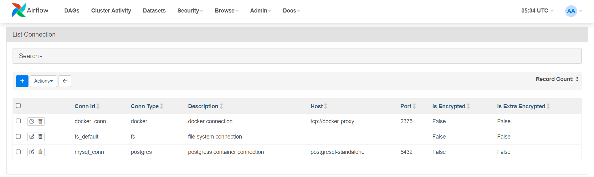
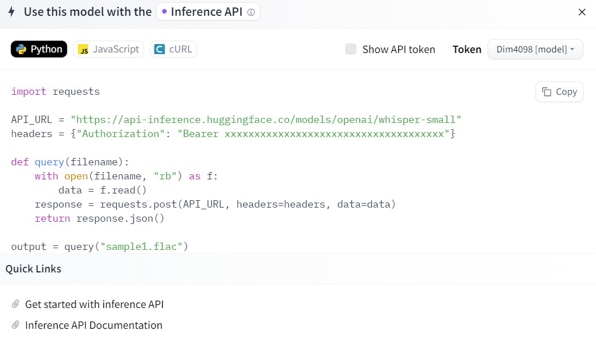
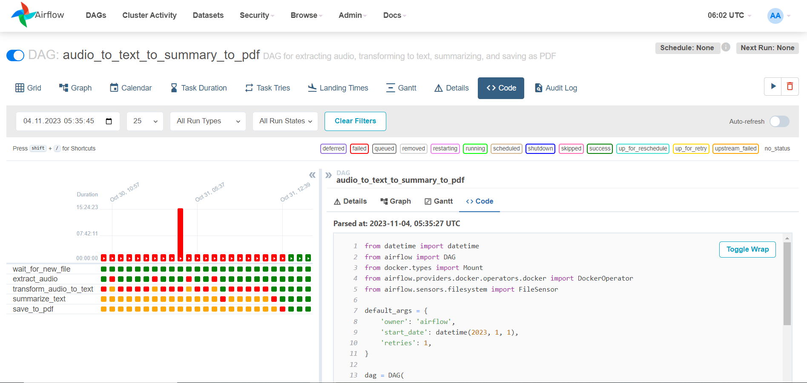
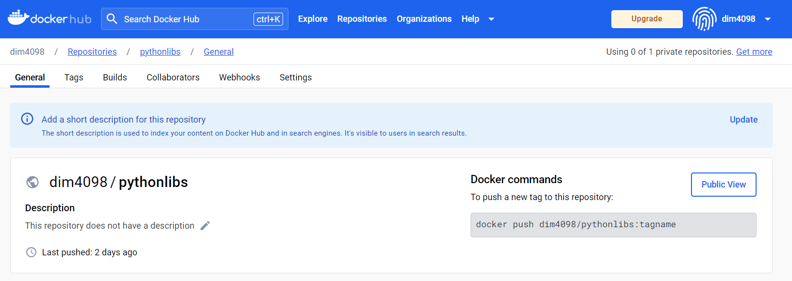
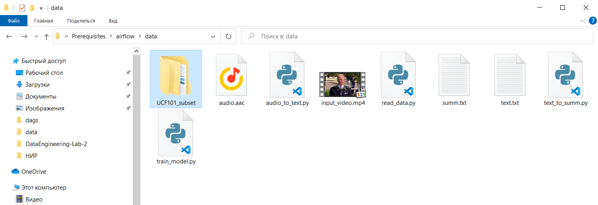
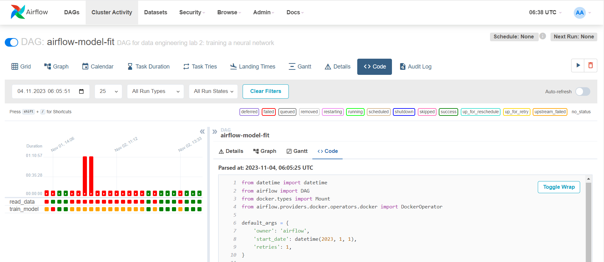

# Отчет по лабораторной работе №2

## Задание на лабораторную работу:
Целю лабораторной работы является знакомство с оператором - DockerOperator, в рамках работы необходимо построить два pipeline - первый позволяет получать предсказания для исходных данных с помощью некоторой модели, второй обучает и/или дообучает нейронную сеть. Оба реализованы при помощи Apache Airflow.

## Ход выполнения лабораторной работы

### Пайплайн для инференса данных

В рамках первого pipeline необходимо последовательно сделать слелдующие операции над данными:
1. Производить мониторинг целевой папки на предмет появления новых видеофайлов.
2. Извлекать аудиодорожку из исходного видеофайла.
3. Преобразовывать аудиодорожку в текст с помощью нейросетевой модели.
4. Формировать конспект на основе полученного текста.
5. Формировать выходной .pdf файл с конспектом.

* Для мониторинга целевой папки на предмет появления новых файлов воспользуемся оператором - FileSensor():
`wait_for_new_file = FileSensor(
    task_id='wait_for_new_file',
    poke_interval=10, 
    filepath='/opt/airflow/data',  # Target folder to monitor
    fs_conn_id='fs_default',
    dag=dag,
)`
Параметрами данного оператора являются **poke_interval* - интервал времени в секундах на проверку исходной директории, **filepath* - путь к директории, **fs_conn* - соединение, последний можно создать в UI airflow в разделе Admin -> Connections (туда же в случае необходимости можно добавить допустим подключение к БД):

* Извлечение аудиодорожки из видеофайла
Остальные части pipeline будут реализованы при помощи DockerOperator(), стоит сказать несколько слов о нем:
`extract_audio = DockerOperator(
    task_id='extract_audio',
    image='jrottenberg/ffmpeg',
    command='-i /data/input_video.mp4 -vn -acodec copy /data/audio.aac',
    mounts=[Mount(source='/data', target='/data', type='bind')],
    docker_url="tcp://docker-proxy:2375",
    dag=dag,
)`
Параметры: **image* - образ docker используемый в качестве основы, **command* - команда выполняемая при старте образа, **mounts* - маппинг внешних values, **docker_url* - адрес хоста на котором запущен демон docker.

Для выполнения описанной выше операции извлечения аудио дорожки используем библиотеку ffmpeg и соответственно публичный образ jrottenberg/ffmpeg.
Преобразование запускается командой "ffmpeg -i /data/input_video.mp4 -vn -acodec copy /data/audio.aac". В качестве файла используем речь президента Байдена.
Результат можно прослушать в директории данного репозитория - audio.aac.

* Преобразование аудио в текст можно выполнить на модели openai-whisper - https://github.com/ahmetoner/whisper-asr-webservice/, можно сделать это несколькими способами, например:
1. Использовать готовый образ docker с обученной моделью, пример - onerahmet/openai-whisper-asr-webservice
2. Воспользоваться внешним API hugging face - https://huggingface.co/openai/whisper-small
3. Собрать собственный образ при помощи библиотеки - https://github.com/huggingface/transformers

Попробуем реализовать второй вариант, его суть отражена в куске кода ниже:

 для этого нам потребуется образ python с библиотекой requests, используем - "nyurik/alpine-python3-requests".
 Далее в этом образе выполним команду запуска нашей программы - "python /data/audio_to_text.py", которая будет читать аудиодорожку и обращаться к внешнему API.
 Листинг программы можно найти в файле - audio_to_text.py, для получения токена необходимо зарегестрироваться на платформе HuggingFace и выпустить токен на запись.

* Формирование конспекта по тексту можно сделать импользуя модель - bart_summarisation, и подход аналогичный описанному выше (HuggingFaceAPI).
Код имеет следующий вид - 
`import requests
API_URL = "https://api-inference.huggingface.co/models/slauw87/bart_summarisation"
API_TOKEN = '<<personal_token>>'
headers = {"Authorization": f"Bearer {API_TOKEN}"}

with open('/data/text.txt', "rb") as f:
    data = f.read()
    response = requests.post(API_URL, headers=headers, json={'inputs': f"{data}",})
    result = response.json()
    text_file = open("/data/summ.txt", "w+")
    text_file.write(result[0]['summary_text'])
    text_file.close() `

* Последним действием является преобразование конспекта в формат pdf, для этого используем библиотеку text2pdf и готовый образ - "mashupmill/text2pdf".
Результат работы DUG представлен на рисунке ниже:

Файл с полным кодом DAG можно найти в указанной директории - airflow-data-interface-node.py

### Пайплайн для обучения модели

Второй pipeline принципиально разделен на две части:
1. read_data - чтение набора файлов из определенного источника (файловой системы, сетевого интерфейса и т.д.) и формирование пакет данных для обучения модели
2. train_model - обучение модели и сохранение результатов

В качестве модели используем нейросеть классификации действий выполняемых на видео (UCF101 dataset) и написанную на основе библиотеки tf
Более подробное описанние модели  - https://www.tensorflow.org/tutorials/video/video_classification,
Данная модель взята мной за основу НИР и реализована в следующем блокноте - https://colab.research.google.com/drive/1izMmRkYNb9NHkCdGHkga5o3hfXtdOVIS?usp=sharing

* Подготовка данных
Для реализации загрузки данных и формирования обучающей, валидационной и тестовой выборки нам понадобится образ, с предустановленными библиотеками - remotezip tqdm opencv-python einops а также open cv для python. Создадим данный образ самостоятельно, для этого создадим docker файл с содержимым ниже -

`FROM python:latest

RUN apt-get update && apt-get install ffmpeg libsm6 libxext6  -y
RUN pip install numpy seaborn scikit-learn pandas opencv-python matplotlib remotezip tqdm einops

LABEL Maintainer="dim4098.me17"

WORKDIR /usr/app/src`

За основу нашего образа взят официалтый образ python, также open-cv требует предустановку некоторых пакетов. 
Далле необходимо выполнить команду сборки образа с указанием на путь к нему: "docker image build -t <<название образа:тег>> <<путь к файлу образа>>"
Так как мы используем docker in docker то необходимо экспортировать созданный образ в dockerHub, для этого выполним:
1. docker login - авторизация 
2. docker images - увидимо что наш образ существует локально 
3. docker tag <<source-image>> <<username>>/<<target-image>>:<<tag>> - создадим образ для экспорта
4. docker push <<target-image>>:<<tag>> - отправка образа в удаленный репозиторий

В итоге получиться что-то похожее:

А сам DAG выглядит так:
`read_data = DockerOperator(
    task_id='read_data',
    image= 'dim4098/pythonlibs:0.0.4',
    command= 'python /data/read_data.py',
    mounts=[Mount(source='/data', target='/data', type='bind')],
    docker_url="tcp://docker-proxy:2375",
    dag=dag,
)`

Полный листинг кода позготовки данных можно найти в файле - "read_data.py". 
Его суть состоит в загрузке данный из удаленного хранилища и формирования пакетов данный, результат работы DAG следующий (в папке /data):

* Обучение модели
Вторая часть состоит в создании модели с архитектурой представленной ниже и ее обучении:

Для этого воспользуемся готовым образом содержащим библиотеку tf - "tensorflow/tensorflow".
И выполним команду - "python /data/train_model.py".
Полный листинг кода создания и обучения модели можно найти в файле - train_model.py.
Результат работы DUG представлен на рисунке ниже:

Файл с полным кодом DAG можно найти в указанной директории - airflow-model-fit-node.py