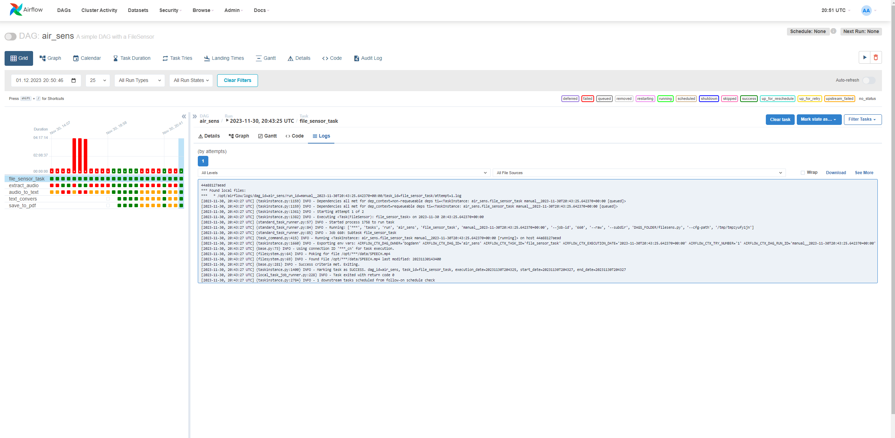
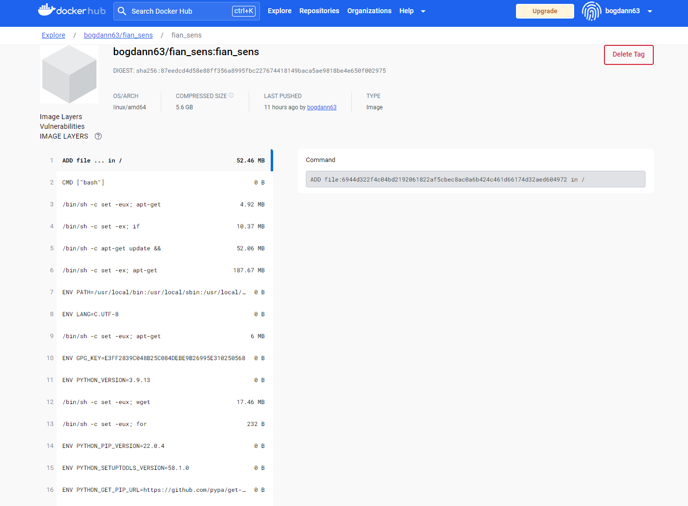
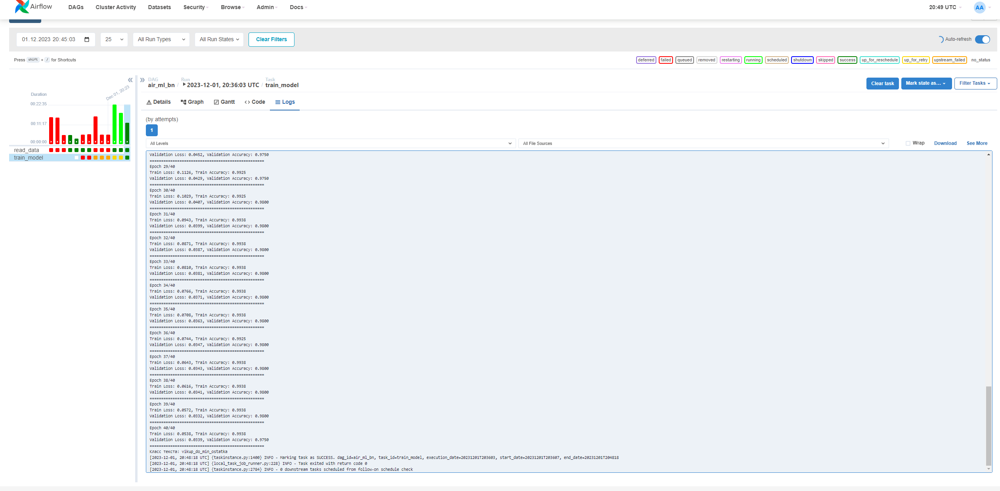

# Лабораторная работа №2
### Выполнил студент 6231-010402D Непряхин Богдан Олегович

Перед тем как начать выполнять работу необходимо подготовить airflow для работы с proxy и dind, для этого в интерфейсу airflow в [разделе соединений ](http://localhost:8080/connection/list/) создаем соединения дающие доступ для локальных файлов и файлов находящихся в proxy


## Задание 1: Пайплайн, который позволяет получить предсказания для исходных данных с помощью некоторой модели.
1. Производить мониторинг целевой папки на предмет появления новых видеофайлов.
- Для решения этой задачи будем использовать функцию DAG FileSensor()
```python
file_path = '/opt/airflow/data/SPEECH.mp4'

# Создайте FileSensor
file_sensor_task = FileSensor(
    task_id='file_sensor_task',
    filepath=file_path,
    fs_conn_id='airflow_cn',
    mode='poke',
    poke_interval=60,
    timeout=600,
    dag=dag,
)
```
Функция "наблюдает за папкой и в рамках указанного интервала времени проверяет есть ли там файл с указанным в file_path названием

2. Извлекаем аудиодорожку из исходного видеофайла.
   ```python
    extract_audio = DockerOperator(
        task_id='extract_audio',
        image='jrottenberg/ffmpeg',
        command='-i /data/SPEECH.mp4 -vn -acodec copy /data/output/audio.aac',
        mounts=[Mount(source='/data', target='/data', type='bind')],
        docker_url="tcp://docker-proxy:2375",
        dag=dag,
    )
    ```
3. Преобразовываем аудиодорожку в текст с помощью нейросетевой модели.
Для преобразования дорожи в текст используем [код py](./scripts/audio_conv.py) в рамках работы другого таска в DAG
    ```python
    audio_to_text = DockerOperator(
        task_id='audio_to_text',
        image='nyurik/alpine-python3-requests',
        command='python /data/scripts/audio_conv.py',
        mounts=[Mount(source='/data', target='/data', type='bind')],
        docker_url="tcp://docker-proxy:2375",
        dag=dag,
    )
    ```

4. Формируем конспект на основе полученного текста.
    ```python
    text_convers = DockerOperator(
        task_id='text_convers',
        image='nyurik/alpine-python3-requests',
        command='python /data/scripts/text_conv.py',
        mounts=[Mount(source='/data', target='/data', type='bind')],
        docker_url="tcp://docker-proxy:2375",
        dag=dag,
    )
    ```
    для реализации этого таска пишем [код ](./scripts/text_conv.py) для которого предварительно получаем токен [API huggingface](api-inference.huggingface.co)

5. Формирeм выходной .pdf файл с конспектом.
    ```python
    save_to_pdf = DockerOperator(
        task_id='save_to_pdf',
        image='mashupmill/text2pdf',
        command='text2pdf /data/output/summ.txt > /data/output/summ.pdf',
        mounts=[Mount(source='/data/output', target='/data/output', type='bind')],
        docker_url="tcp://docker-proxy:2375",
        dag=dag,
    )
    ```
    На выходе мы имеем pdf файл с текстом содержащим краткий пересказ [текста из видео](./output/summ.pdf)

Весь код DAGa из первого задания доступен [здесь>>](.dags/filesens.py)
Ход выполнения работы DAG 

#### Подготовка к заданию 2
Перед тем как начать обучать модель необходимо создать свой Dockerfile, который создаст для нас image для работы нашего кода с моделью.
-  [Создаем Dockerfile](./Dockerfile) прописываем в него все необходимые для инсталляции пакеты py и указываем версию Питона которая будет выполнять код для обучения (жестко фиксируем 3.9.13 тк некоторые пакеты на свежих версиях ведут себя не предсказуемо)
- Формируем image (здесь было не просто но [тут](https://linuxhint.com/push-and-pull-docker-image-to-docker-hub/#b) четко поясняют что нужно делать)
- Теперь у нас все готово для решения 2ой задачи 

# Задание 2: Пайплайн, который позволяет обучить или дообучить целевую модель.

- Формируем DAG в который добавляем наш tarin для обучения [модели](.dags/ml_air.py)
Читаем данные из исходного [датасета](./data/scripts/read_data.py). Набор данных содержит в себе 18 категорий текстов, которые необходимо классифицировать используя Bert модель. Цель модели научиться предсказывать категории текстов при "общении" с моделью реальных людей.

- После того как данные предобработаны они сохраняются в датасет для обучения и передаются в [модель](./data/scripts/training_model.py) 


Итогом работы кода является сохранненая модель, которая может использоваться далее в работе чат бота.
Для обучения используется только 1000 строк тк весь датасет не "прокрутится" на CPU надо GPU, с пробросом GPU в airflow задачу не решал тк не хватило времени но в будущем думаю разберусь с этим.
